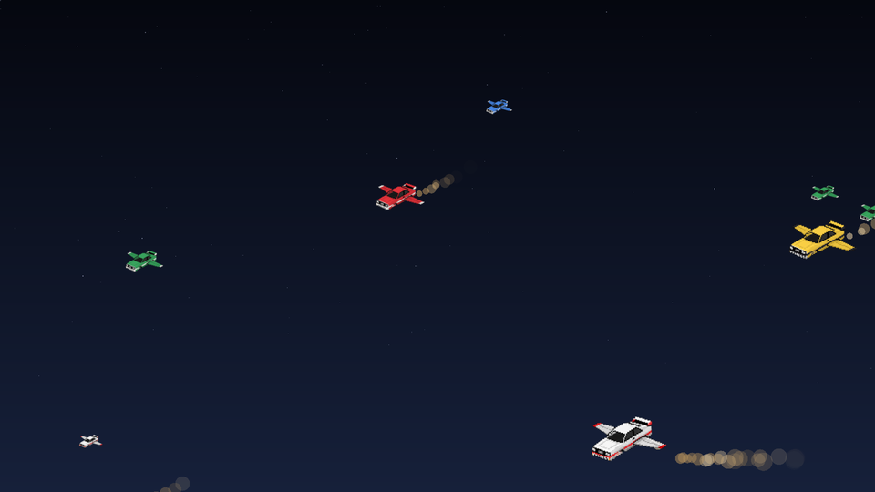
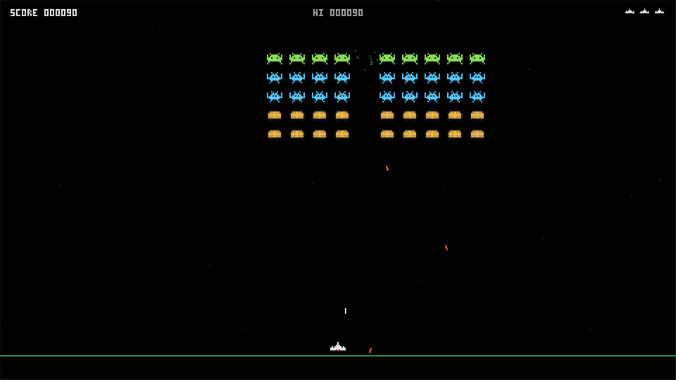
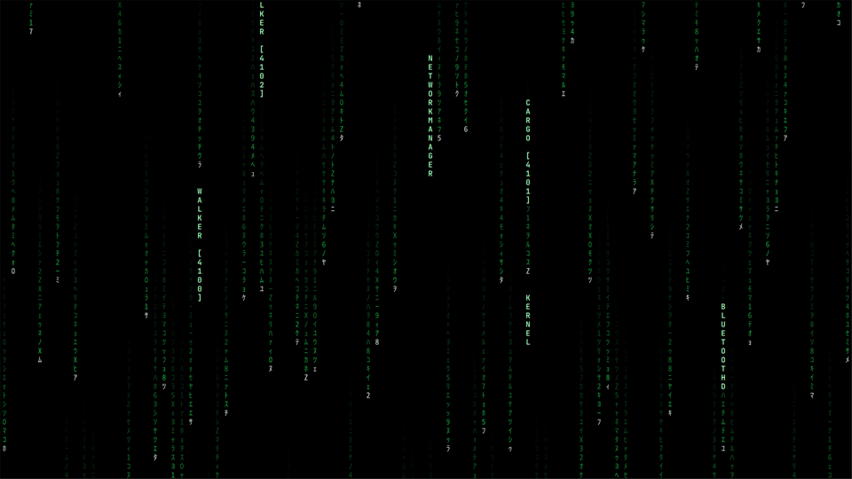
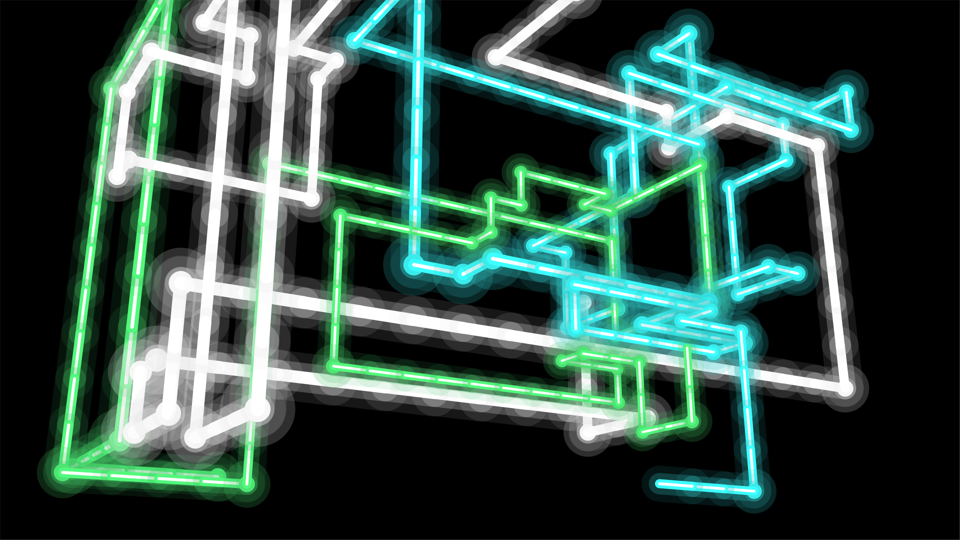
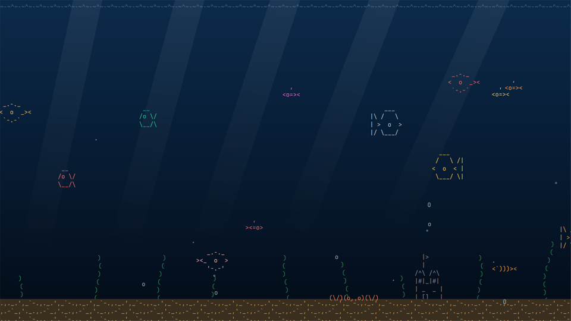
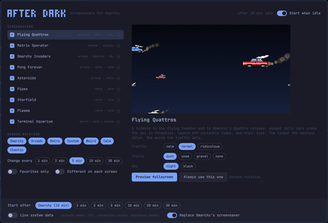

# MIB After Dark



A collection of nostalgic, playful, and system-aware screensavers for
[Omarchy](https://omarchy.org).

When your machine goes idle, something interesting should happen. After Dark
brings back the personality of classic screensavers, rebuilt for a modern Linux
desktop: Omarchy-themed animations, arcade machines that play themselves,
classic computer effects, and screensavers driven by what the machine is
actually doing. It should feel like the kind of software people used to make
when computers were allowed to be fun.

An Omarchy shell plugin. It runs inside `omarchy-shell`, draws on every screen
when the machine goes idle, and can take over from Omarchy's built-in terminal
screensaver.

## The screensavers

| | Screensaver | What happens |
|---|---|---|
| Omarchy | **Flying Quattros** | Winged rally cars cross the sky in formation, trailing dust, snow or gravel. Near cars are big and fast, far ones small and slow. Some drive along the bottom, hit an invisible jump, and take off. The longer the machine idles, the worse the traffic gets. |
| System | **Matrix Operator** | The computer as an overdramatic command-and-control system. Four views: an **operator** console (process table, network, event stream, core telemetry), **code rain** with real events surfacing in it, a Hollywood **intrusion** sequence built on harmless telemetry, and a live **trace** of processes and the hosts they talk to. |
| Arcade | **Omarchy Invaders** | A self-playing invasion: package swarms, dependency attacks where one hit takes out everything below it, a kernel boss, root power-ups and a Quattro bonus stage. |
| Arcade | **Pong Forever** | QUATTRO vs TUX, a match that may continue for months. Classic, Impossible, Four Paddle, Multiball, Tiny Paddle, Quattro vs Tux, and Ludicrous. The lifetime score serves absolutely no purpose and is therefore preserved. |
| Arcade | **Asteroids** | A vector ship that aims, dodges and jumps to hyperspace on its own. In Omarchy mode the rocks are `node_modules`, `texlive-full`, `rm` and friends. |
| Arcade | **Moon Patrol** | A six-wheeled buggy drives the lunar highway from A to Z on its own, jumping craters, blasting boulders and shooting saucers and their bombs out of the sky. With Quattro on, some stretches are a rally stage in a quattro, and a winged one now and then flies over, worth 5000 if the buggy can hit it. |
| Classic | **Pipes** | The 3D pipes, grown in shaded, neon or wireframe until the room is full. |
| Classic | **Starfield** | From a faithful minimal cruise to completely excessive hyperspace. Every few minutes the ship jumps to warp on its own. |
| Classic | **Plasma** | Demo-scene plasma with a sine scroller. Minimal configuration, maximum late-1990s energy. |
| Weird | **Terminal Aquarium** | A living ASCII tank. With live system data on, CPU load makes bubbles, network traffic brings schools of fish, SSH sessions summon submarines, and the battery level sets the light. |

Each has its own options in the control panel (traffic, trails, variant,
palette, view, and so on).

Some things are not documented. Leave it running.

<p>




</p>

## Install

```bash
omarchy plugin add https://github.com/mindows/mib-afterdark.git --enable
```

Once it is enabled:

- After Dark starts after Omarchy's own screensaver delay (`idle.screensaver`
  in `~/.config/omarchy/shell.json`), on every screen.
- The first time it loads, the control panel opens and asks whether After
  Dark should replace Omarchy's built-in terminal screensaver. Nothing of
  Omarchy's changes until you choose **Replace Omarchy's screensaver**, which
  switches the built-in one off with Omarchy's own toggle
  (`omarchy toggle screensaver`). **Not now**, or closing the panel, leaves it
  on, and both start on idle. The same switch is at the bottom of the control
  panel, so you can change your mind either way.
- Two launcher entries appear: **After Dark** (the control panel) and
  **After Dark: Start Screensaver**.

Omarchy still owns locking. After Dark only draws: when `idle.lock` comes
around, the lock screen appears over it and it pauses until you unlock. It
never starts while the session is locked, and it respects Omarchy's
stay-awake indicator.

Any key, click, scroll, or mouse movement ends the screensaver.

## Remove

If you let After Dark replace Omarchy's screensaver, turn **Replace Omarchy's
screensaver** off in the control panel first, so Omarchy's own comes back on.
Then:

```bash
omarchy plugin remove io.github.mindows.mib-afterdark
```

If you already removed it, switch Omarchy's screensaver back on with
`omarchy-toggle screensaver-off off`.

The launcher entries, your settings, community modules and scores stay
behind; to remove those too:

```bash
rm -f ~/.local/share/applications/mib-afterdark.desktop \
      ~/.local/share/applications/mib-afterdark-start.desktop
rm -rf ~/.config/mib-afterdark ~/.local/state/mib-afterdark
```

## The control panel



Open it from the launcher (**After Dark**), or:

```bash
omarchy-shell shell toggle io.github.mindows.mib-afterdark
```

- **Screensavers**: the checkbox includes or excludes one from Random mode;
  the star makes it a favorite (picked three times as often). The preview on
  the right is live; click it, or press Enter, to preview fullscreen.
- **Options**: each screensaver's own settings, applied as you change them.
- **Always use this one** / **Back to random**.
- **Random rotation**: which categories Random mode picks from (Omarchy,
  Arcade, Retro, System, Weird, Calm, Chaotic), how often it changes, favorites
  only, and a different screensaver on each screen.
- **Start after**: follow Omarchy's delay, or set After Dark's own.
- **Live system data** and **Replace Omarchy's screensaver** (below).

Keys: Up/Down (or j/k) select, Space includes or excludes, F favorites, Enter
previews, Esc closes.

## From the command line

```bash
id=io.github.mindows.mib-afterdark
omarchy-shell shell call $id start random         # start now
omarchy-shell shell call $id start pong           # preview one (no rotation)
omarchy-shell shell call $id next ""              # rotate to another
omarchy-shell shell call $id stop ""
omarchy-shell shell call $id status ""            # JSON
```

Bind `start random` to a key in `~/.config/hypr/bindings.lua` if you want a
"screensaver now" shortcut.

## Live system data

Off by default. Matrix Operator and Terminal Aquarium run on a simulation
until it is turned on (the console says **SIMULATION** in its header, and
**LIVE** once it is on).

When it is on, and only while one of those two is on screen, After Dark reads:

| Source | What is used |
|---|---|
| `/proc/stat`, `/proc/meminfo`, `/proc/net/dev`, `/proc/uptime`, `/proc/loadavg` | CPU, memory, network totals, uptime, load |
| `ps -eo pid,pcpu,pmem,comm` | process ids, names and CPU, every 2 s |
| `ss -tunpH state established` | established connections and the name of the process that owns them (your own processes only), every 3 s |
| `journalctl -f -o json` | the unit or identifier name of each new journal entry. Message text is never read. |
| `tail -F /var/log/pacman.log` | the verb and package name of installs and upgrades |
| UPower | battery level |

Remote addresses are shown masked to their first half (`203.0.x.x`,
`2607:6bc0:…`). The hostname is shown in Matrix Operator. The screensaver is
on screen while you are away, so anything it shows can be read by whoever
walks past; leave live data off if that matters where you work.

Nothing is sent anywhere. After Dark makes no network requests.

## Files

| Path | What |
|---|---|
| `~/.config/mib-afterdark/settings.json` | your choices; hand edits are read back live |
| `~/.config/mib-afterdark/screensavers/` | community screensaver modules |
| `~/.local/state/mib-afterdark/state.json` | what the screensavers remember (Pong's lifetime score, high scores), and that the first-run question was answered |
| `~/.local/share/applications/mib-afterdark*.desktop` | the two launcher entries (only files carrying the `X-MIB-AfterDark-Managed` marker are ever written) |

## Community screensavers

A screensaver is a folder with a `module.json` and a QML file. Drop one into
`~/.config/mib-afterdark/screensavers/` and it appears in the control panel
within a second; remove the folder and it goes away. See
[docs/MODULES.md](docs/MODULES.md) for the format and the `host` API, and
[docs/examples/bouncing-logo](docs/examples/bouncing-logo) for a complete
example to copy.

A module runs inside `omarchy-shell` with the same access as the plugin
itself. Only install modules whose code you have read.

## Performance

Screensavers run for hours, so they are built to be cheap: pixel-art sprites
are painted once and moved by the GPU, Plasma, Starfield and the code rain are
fragment shaders, and nothing redraws a full-screen canvas every frame. On a
2018 Intel laptop (UHD 620, 1920x1080) each screensaver costs between 2% and
16% of one CPU core. Everything pauses while the screen is locked.

## Requirements

- Omarchy with the Quickshell-based `omarchy-shell` (the plugin system)
- `procps-ng` (`ps`) and `iproute2` (`ss`), both part of a standard install,
  for live system data
- A CJK font for katakana code rain (Omarchy ships Noto CJK); without one the
  rain falls back to Latin glyphs

## Development

Work in your own copy of this repository, and point Omarchy at it with a
symlink in place of an installed copy:

```bash
ln -sfn "$PWD" ~/.config/omarchy/plugins/io.github.mindows.mib-afterdark
omarchy plugin enable io.github.mindows.mib-afterdark
```

After a change, restart the shell with `omarchy-restart-shell`; a symlinked
plugin is not watched for edits.

- `tools/snapshot.sh <module> [seconds] [out.png] [w] [h] [options-json]`
  renders a screensaver headlessly and saves a PNG (not for shader modules).
- `tools/preview.sh <module> [options-json] [seconds]` runs one in a window on
  the desktop, shaders included.
- `tools/build-shaders.sh` rebuilds the committed `.qsb` files from the
  `.frag` sources (needs `qt6-shadertools`).

See [CONTRIBUTING.md](CONTRIBUTING.md).

## Credits

The flying quattro (`lib/art/`, in six liveries) is original artwork by Min
Kim. Audi, quattro and the four rings are trademarks of AUDI AG; this is a fan
tribute, not affiliated with or endorsed by Audi. All other artwork is pixel
art drawn from scratch for this plugin, and nothing here uses the original
After Dark or Flying Toasters assets.

## License

[MIT](LICENSE)
